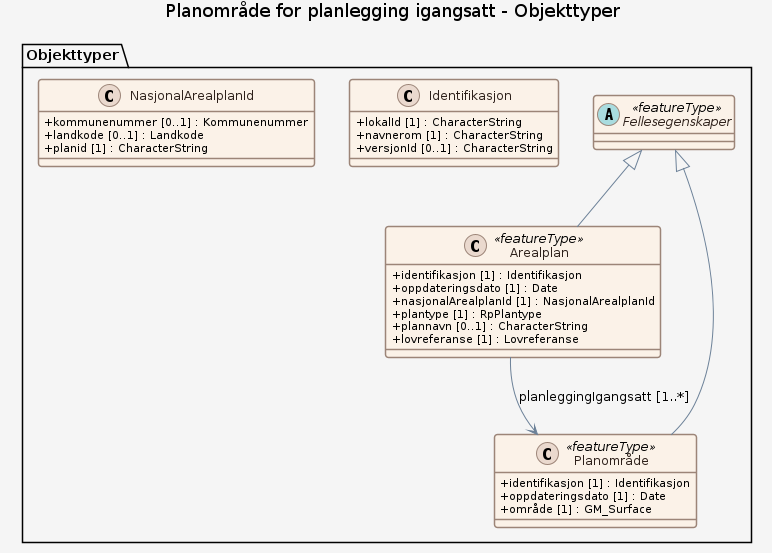

# Produktspesifikasjon: Planområde for planlegging igangsatt

## Generelt om spesifikasjonen

### Unik identifisering

779a554b-fc3e-48a6-b202-561b07e9d4c2

#### Fullstendig navn

Planområde for planlegging igangsatt

#### Versjon

2025-10-17

### Referansedato

2025-10-17

### Ansvarlig organisasjon

Direktoratet for byggkvalitet

### Språk

nor

### Hovedtema

planområde, planomriss, Arealplan, Plan

### Temakategori

Plan og eiendom

### Sammendrag

Datasettet viser område(r) hvor det er varslet at planlegging skal igangsettes etter plan- og bygningsloven (pbl). Formålet er å kunne identifisere og vise hvor planarbeid er startet, slik at naboer, berørte parter, høringsmyndigheter og kommunen får informasjon om planinitiativet.

### Formål

Formålet er å kunne identifisere og vise hvor planarbeid er startet, slik at naboer, berørte parter, høringsmyndigheter og kommunen får informasjon om planinitiativet og kan medvirke i prosessen.

### Bruksområde

Datasettet brukes som grunnlag ved oversendelse av planinitiativ til kommunen og høringsparter, i varsel om oppstart av planarbeid, som underlag i saksbehandling, uttalelser fra høringsmyndigheter og registrering i  kommunale planregister, samt for visning i kartløsninger.

### Romlig representasjonstype

Rasterbilde/digital terrengmodell

### Romlig oppløsning

**Avstand**:

- **Måleenhet**: meter
- **Verdi**: 0.01

### Utstrekning

**Geografisk utstrekning**:

- **Vest**: 2.0
- **Øst**: 33.0
- **Sør**: 57.0
- **Nord**: 72.0

**Tidsmessig utstrekning**:

- **Tidsperiode**:
  - **Fra**: 2025-10-17
  - **Til**: 2025-10-17

### Begrensninger

**Juridiske begrensninger**:

- **Tilgangsbegrensninger**: Åpne data
- **Bruksbegrensninger**: Lisens
- **Lisens**: Norsk lisens for offentlige data (NLOD) 2.0
- **Lisenslenke**: <https://data.norge.no/nlod/no/2.0>

**Sikkerhetsbegrensninger**:

- **Klassifisering**: Ugradert

## Spesifikasjonsomfang

- **Omfang**:

  - **Identifikasjon**: hele datasettet
  - **Nivå**: dataset
  - **Utstrekning**: - **Beskrivelse**: National

## Innhold og struktur

**Beskrivelse**: Datasettet brukes som grunnlag ved oversendelse av planinitiativ til kommunen og høringsparter, i varsel om oppstart av planarbeid, som underlag i saksbehandling, uttalelser fra høringsmyndigheter og registrering i  kommunale planregister, samt for visning i kartløsninger.

### Datamodell

#### Fellesegenskaper (abstrakt)

abstrakt objekttype som bærer de egenskapene fra SOSI_Fellesegenskaper som er anvendt på objekttypene i denne modellen.

Egenskaper

<table class="feature-attribute-table">
  <colgroup>
    <col style="width: 35%;" />
    <col style="width: 65%;" />
  </colgroup>
  <tbody>
    <tr>
      <th scope="row">Navn:</th>
      <td><strong>identifikasjon</strong></td>
    </tr>
    <tr>
      <th scope="row">Definisjon:</th>
      <td>unik identifikasjon av et dataobjekt  Følger dataobjektet og identifiserer det i hele dets levetid.</td>
    </tr>
    <tr>
      <th scope="row">Multiplisitet:</th>
      <td>1</td>
    </tr>
    <tr>
      <th scope="row">Type:</th>
      <td>Identifikasjon</td>
    </tr>
  </tbody>
</table>

<table class="feature-attribute-table">
  <colgroup>
    <col style="width: 35%;" />
    <col style="width: 65%;" />
  </colgroup>
  <tbody>
    <tr>
      <th scope="row">Navn:</th>
      <td><strong>identifikasjon.lokalId</strong></td>
    </tr>
    <tr>
      <th scope="row">Definisjon:</th>
      <td>lokal identifikator av et objekt.  Skal være en uuid, slik at den er unik, uavhengig av navnerommet</td>
    </tr>
    <tr>
      <th scope="row">Multiplisitet:</th>
      <td>1</td>
    </tr>
    <tr>
      <th scope="row">Type:</th>
      <td>CharacterString</td>
    </tr>
  </tbody>
</table>

<table class="feature-attribute-table">
  <colgroup>
    <col style="width: 35%;" />
    <col style="width: 65%;" />
  </colgroup>
  <tbody>
    <tr>
      <th scope="row">Navn:</th>
      <td><strong>identifikasjon.navnerom</strong></td>
    </tr>
    <tr>
      <th scope="row">Definisjon:</th>
      <td>navnerom som unikt identifiserer datakilden til et objekt.  Navnerom anbefales å være en http-URI og må være registrert i data.geonorge.no For plan anbefales navnerommet <a href="http://data.geonorge.no/sosi/plan">http://data.geonorge.no/sosi/plan</a></td>
    </tr>
    <tr>
      <th scope="row">Multiplisitet:</th>
      <td>1</td>
    </tr>
    <tr>
      <th scope="row">Type:</th>
      <td>CharacterString</td>
    </tr>
  </tbody>
</table>

<table class="feature-attribute-table">
  <colgroup>
    <col style="width: 35%;" />
    <col style="width: 65%;" />
  </colgroup>
  <tbody>
    <tr>
      <th scope="row">Navn:</th>
      <td><strong>identifikasjon.versjonId</strong></td>
    </tr>
    <tr>
      <th scope="row">Definisjon:</th>
      <td>identifikasjon av en spesiell versjon av et geografisk objekt (instans)</td>
    </tr>
    <tr>
      <th scope="row">Multiplisitet:</th>
      <td>0..1</td>
    </tr>
    <tr>
      <th scope="row">Type:</th>
      <td>CharacterString</td>
    </tr>
  </tbody>
</table>

<table class="feature-attribute-table">
  <colgroup>
    <col style="width: 35%;" />
    <col style="width: 65%;" />
  </colgroup>
  <tbody>
    <tr>
      <th scope="row">Navn:</th>
      <td><strong>oppdateringsdato</strong></td>
    </tr>
    <tr>
      <th scope="row">Definisjon:</th>
      <td>tidspunkt for siste endring på dataobjektet</td>
    </tr>
    <tr>
      <th scope="row">Multiplisitet:</th>
      <td>1</td>
    </tr>
    <tr>
      <th scope="row">Type:</th>
      <td>DateTime</td>
    </tr>
  </tbody>
</table>

#### Arealplan

dataobjekt for igangsatt planlegging etter pbl

Egenskaper

<table class="feature-attribute-table">
  <colgroup>
    <col style="width: 35%;" />
    <col style="width: 65%;" />
  </colgroup>
  <tbody>
    <tr>
      <th scope="row">Navn:</th>
      <td><strong>nasjonalArealplanId</strong></td>
    </tr>
    <tr>
      <th scope="row">Definisjon:</th>
      <td>landsdekkende entydig og unik identifikasjon av en arealplan (pbl. §§ 6-4, 9-1, og 12-1, samt kart- og planforskriften § 9 andre og sjette ledd).  Denne identifikatoren tildeles planen når planprosessen starter, og den kan ikke endres undervegs av forslagstiller.</td>
    </tr>
    <tr>
      <th scope="row">Multiplisitet:</th>
      <td>1</td>
    </tr>
    <tr>
      <th scope="row">Type:</th>
      <td>NasjonalArealplanId</td>
    </tr>
  </tbody>
</table>

<table class="feature-attribute-table">
  <colgroup>
    <col style="width: 35%;" />
    <col style="width: 65%;" />
  </colgroup>
  <tbody>
    <tr>
      <th scope="row">Navn:</th>
      <td><strong>nasjonalArealplanId.kommunenummer</strong></td>
    </tr>
    <tr>
      <th scope="row">Definisjon:</th>
      <td>kode som viser til offisiell nummerering av kommuner  Merknad: Det presiseres at kommunenummer alltid skal ha 4 siffer, dvs. eventuelt med ledende null. Kommunenummer benyttes for kobling mot en rekke andre registre som også benytter 4 siffer.</td>
    </tr>
    <tr>
      <th scope="row">Multiplisitet:</th>
      <td>0..1</td>
    </tr>
    <tr>
      <th scope="row">Type:</th>
      <td>Kommunenummer</td>
    </tr>
    <tr>
      <th scope="row">Tillatte verdier:</th>
      <td>- Kodeliste: <a href="https://register.geonorge.no/sosi-kodelister/inndelinger/inndelingsbase/kommunenummer">https://register.geonorge.no/sosi-kodelister/inndelinger/inndelingsbase/kommunenummer</a></td>
    </tr>
  </tbody>
</table>

<table class="feature-attribute-table">
  <colgroup>
    <col style="width: 35%;" />
    <col style="width: 65%;" />
  </colgroup>
  <tbody>
    <tr>
      <th scope="row">Navn:</th>
      <td><strong>nasjonalArealplanId.landkode</strong></td>
    </tr>
    <tr>
      <th scope="row">Definisjon:</th>
      <td>landkode = NO anvendes kun av statlig vedtaksmyndighet</td>
    </tr>
    <tr>
      <th scope="row">Multiplisitet:</th>
      <td>0..1</td>
    </tr>
    <tr>
      <th scope="row">Type:</th>
      <td>Landkode</td>
    </tr>
    <tr>
      <th scope="row">Tillatte verdier:</th>
      <td>- NO – Norge. Aktuell kode for administrativ enhet for statlig vedtatte planer</td>
    </tr>
  </tbody>
</table>

<table class="feature-attribute-table">
  <colgroup>
    <col style="width: 35%;" />
    <col style="width: 65%;" />
  </colgroup>
  <tbody>
    <tr>
      <th scope="row">Navn:</th>
      <td><strong>nasjonalArealplanId.planid</strong></td>
    </tr>
    <tr>
      <th scope="row">Definisjon:</th>
      <td>entydig identifikasjon av en plan innen vedkommende administrative enhet (pbl. §§ 9-1, 12-1, samt kart- og planforskriften § 9 andre og sjette ledd)</td>
    </tr>
    <tr>
      <th scope="row">Multiplisitet:</th>
      <td>1</td>
    </tr>
    <tr>
      <th scope="row">Type:</th>
      <td>CharacterString</td>
    </tr>
  </tbody>
</table>

<table class="feature-attribute-table">
  <colgroup>
    <col style="width: 35%;" />
    <col style="width: 65%;" />
  </colgroup>
  <tbody>
    <tr>
      <th scope="row">Navn:</th>
      <td><strong>plantype</strong></td>
    </tr>
    <tr>
      <th scope="row">Definisjon:</th>
      <td>type reguleringsplan (pbl. §§ 12-2 og 12-3)</td>
    </tr>
    <tr>
      <th scope="row">Multiplisitet:</th>
      <td>1</td>
    </tr>
    <tr>
      <th scope="row">Type:</th>
      <td>RpPlantype</td>
    </tr>
    <tr>
      <th scope="row">Tillatte verdier:</th>
      <td>- Kodeliste: <a href="https://register.geonorge.no/sosi-kodelister/plan/reguleringsplanforslag/rpplantype">https://register.geonorge.no/sosi-kodelister/plan/reguleringsplanforslag/rpplantype</a></td>
    </tr>
  </tbody>
</table>

<table class="feature-attribute-table">
  <colgroup>
    <col style="width: 35%;" />
    <col style="width: 65%;" />
  </colgroup>
  <tbody>
    <tr>
      <th scope="row">Navn:</th>
      <td><strong>plannavn</strong></td>
    </tr>
    <tr>
      <th scope="row">Definisjon:</th>
      <td>planens offisielle navn</td>
    </tr>
    <tr>
      <th scope="row">Multiplisitet:</th>
      <td>0..1</td>
    </tr>
    <tr>
      <th scope="row">Type:</th>
      <td>CharacterString</td>
    </tr>
  </tbody>
</table>

<table class="feature-attribute-table">
  <colgroup>
    <col style="width: 35%;" />
    <col style="width: 65%;" />
  </colgroup>
  <tbody>
    <tr>
      <th scope="row">Navn:</th>
      <td><strong>lovreferanse</strong></td>
    </tr>
    <tr>
      <th scope="row">Definisjon:</th>
      <td>kode for hvilken lov planen vedtas etter  For reguleringsplanforslag og planlegging igangsatt skal lovreferanse = 6 (pbl 2008)</td>
    </tr>
    <tr>
      <th scope="row">Multiplisitet:</th>
      <td>1</td>
    </tr>
    <tr>
      <th scope="row">Type:</th>
      <td>Lovreferanse</td>
    </tr>
    <tr>
      <th scope="row">Tillatte verdier:</th>
      <td>- Kodeliste: <a href="https://register.geonorge.no/sosi-kodelister/plan/reguleringsplanforslag/lovreferanse">https://register.geonorge.no/sosi-kodelister/plan/reguleringsplanforslag/lovreferanse</a></td>
    </tr>
  </tbody>
</table>

Relasjoner

**Arv**
Fellesegenskaper

**Assosiasjoner**
Planområde – rolle: planleggingIgangsatt – kardinalitet: 1..*

#### Planområde

område for planlegging igangsatt etter pbl 2008.  Området skal være sammenhengende i grunnriss, men kan dekke flere vertikalnivåer

Egenskaper

<table class="feature-attribute-table">
  <colgroup>
    <col style="width: 35%;" />
    <col style="width: 65%;" />
  </colgroup>
  <tbody>
    <tr>
      <th scope="row">Navn:</th>
      <td><strong>område</strong></td>
    </tr>
    <tr>
      <th scope="row">Definisjon:</th>
      <td>planens utstrekning i grunnriss uavhengig av vertikalnivå</td>
    </tr>
    <tr>
      <th scope="row">Multiplisitet:</th>
      <td>1</td>
    </tr>
    <tr>
      <th scope="row">Type:</th>
      <td>GM_Surface</td>
    </tr>
  </tbody>
</table>

Relasjoner

**Arv**
Fellesegenskaper

### Kodelister

#### «CodeList» Kommunenummer

**Definisjon:** ekstern kodeliste for kommunenummer
Koder med status Gyldig refererer til dagens kommuner, mens koder med status Utgått referer til utgåtte kommunenummer

Profilparametre i tagged values

<table class="feature-attribute-table">
  <colgroup>
    <col style="width: 35%;" />
    <col style="width: 65%;" />
  </colgroup>
  <tbody>
    <tr>
      <th scope="row">asDictionary</th>
      <td>true</td>
    </tr>
    <tr>
      <th scope="row">codeList</th>
      <td><a href="https://register.geonorge.no/sosi-kodelister/inndelinger/inndelingsbase/kommunenummer">https://register.geonorge.no/sosi-kodelister/inndelinger/inndelingsbase/kommunenummer</a></td>
    </tr>
  </tbody>
</table>

#### «Enumeration» Landkode

**Definisjon:** alfanumerisk kode for nasjonalt nivå / Norge.

Avledet fra "ISO 3166 Codes for the representation of names of countries and their subdivisions"

Koder

<table class="code-list-table">
  <thead>
    <tr>
      <th>Kodenavn:</th>
      <th>Definisjon:</th>
      <th>Kodeverdi:</th>
    </tr>
  </thead>
  <tbody>
    <tr>
      <td>NO</td>
      <td>Norge. Aktuell kode for administrativ enhet for statlig vedtatte planer</td>
      <td></td>
    </tr>
  </tbody>
</table>

#### «CodeList» RpPlantype

**Definisjon:** ekstern kodeliste for type reguleringsplan (pbl. §§ 12-2 og 12-3) ihht til gjeldende lov. Angir om planen er en områdeplan eller detaljplan.

Profilparametre i tagged values

<table class="feature-attribute-table">
  <colgroup>
    <col style="width: 35%;" />
    <col style="width: 65%;" />
  </colgroup>
  <tbody>
    <tr>
      <th scope="row">asDictionary</th>
      <td>true</td>
    </tr>
    <tr>
      <th scope="row">codeList</th>
      <td><a href="https://register.geonorge.no/sosi-kodelister/plan/reguleringsplanforslag/rpplantype">https://register.geonorge.no/sosi-kodelister/plan/reguleringsplanforslag/rpplantype</a></td>
    </tr>
  </tbody>
</table>

#### «CodeList» Lovreferanse

**Definisjon:** ekstern kodeliste for gjeldende pbl.

Profilparametre i tagged values

<table class="feature-attribute-table">
  <colgroup>
    <col style="width: 35%;" />
    <col style="width: 65%;" />
  </colgroup>
  <tbody>
    <tr>
      <th scope="row">asDictionary</th>
      <td>true</td>
    </tr>
    <tr>
      <th scope="row">codeList</th>
      <td><a href="https://register.geonorge.no/sosi-kodelister/plan/reguleringsplanforslag/lovreferanse">https://register.geonorge.no/sosi-kodelister/plan/reguleringsplanforslag/lovreferanse</a></td>
    </tr>
  </tbody>
</table>

## Kvalitet

**Nivå**: dataset

## Datafangst

**Datainnsamling og prosessering**:

- **Prosesstrinn**: - **Beskrivelse**: datafangst skjer gjennom tjenesten varsel om planoppstart på fellestjenester plan som fylles ut av forslagsstiller eller plankonsulent

## Datavedlikehold

**Vedlikeholdsfrekvens**: Kontinuerlig

**Status**: Planlagt

## Leveranse

- **Leveranse**:

  - **Leveransemedium**:
    - **unitsOfDelivery**: landsfiler
    - **Medienavn**: OGC API-Features
    - **Leveransetjeneste**:
      - **Tjenesteendepunkt**: <https://plandata.ft.dibk.no/services/rest/planleggingigangsatt>
      - **Tjenesteegenskap**:
        - **type**: OGC API-Features
        - **Verdi**: OGC:API-Features
  - **Leveranseformat**: - **Formatnavn**: GeoJSON

- **Leveranse**:

  - **Leveransemedium**:
    - **unitsOfDelivery**: landsfiler
    - **Medienavn**: WMS-tjeneste
    - **Leveransetjeneste**:
      - **Tjenesteendepunkt**: <https://plandata.ft.dibk.no/services/wms/planleggingigangsatt/?service=WMS&request=GetCapabilities>
      - **Tjenesteegenskap**:
        - **type**: WMS-tjeneste
        - **Verdi**: OGC:WMS
  - **Leveranseformat**:
    - **Formatnavn**: PNG

    - **Formatnavn**: BMP

    - **Formatnavn**: GeoTIFF

    - **Formatnavn**: JPEG

    - **Formatnavn**: TIFF

- **Leveranse**:

  - **Leveransemedium**:
    - **Medienavn**: Planområde for planlegging igangsatt
    - **Leveransetjeneste**:
      - **Tjenesteendepunkt**: <https://plandata.ft.dibk.no/services/wms/planleggingigangsatt/?service=WMS&request=GetCapabilities>
      - **Tjenesteegenskap**:
        - **type**: Planområde for planlegging igangsatt
        - **Verdi**: WMS-tjeneste
  - **Leveranseformat**: - **Formatnavn**: PNG
  - **Leveranseomfang**: Tjeneste

## Metadata

**Metadatastandard**: ISO19115

**Metadatastandardversjon**: 2003

**Metadatadato**: 2026-01-28

**språk**: nor

**Kontakt**:

- **Organisasjon**: Direktoratet for byggkvalitet
- **Kontaktperson**: Olaug Hana Nesheim
- **Logo**: <https://register.geonorge.no/data/organizations/974760223_DIBK_liten.jpg>
- **Epost**: ftb@dibk.no
- **rolle**: pointOfContact

**Metadataidentifikator**:

- **Utsteder**: Geonorge
- **kode**: 779a554b-fc3e-48a6-b202-561b07e9d4c2
- **koderom**: <https://kartkatalog.geonorge.no/metadata/>
- **Metadatalenke**: <https://kartkatalog.geonorge.no/metadata/779a554b-fc3e-48a6-b202-561b07e9d4c2>

**Lenker**:

- **lenke**: <https://www.geonorge.no/geonetwork/srv/nor/csw?service=CSW&request=GetRecordById&version=2.0.2&outputSchema=http://www.isotc211.org/2005/gmd&elementSetName=full&id=779a554b-fc3e-48a6-b202-561b07e9d4c2>
  **relasjon**: describedby
  **type**: application/xml
  **tittel**: Metadata (ISO 19139)

- **lenke**: <https://plandata.ft.dibk.no/services/rest/planleggingigangsatt>
  **relasjon**: enclosure
  **type**: text/html
  **tittel**: Nedlasting

- **lenke**: <https://plandata.ft.dibk.no/services/wms/planleggingigangsatt/?service=WMS&request=GetCapabilities>
  **relasjon**: alternate
  **type**: text/html
  **tittel**: Kartvisning

- **lenke**: #!?zoom=3&lon=306722&lat=7197864&wms=<https://plandata.ft.dibk.no/services/wms/planleggingigangsatt/>
  **relasjon**: service
  **type**: text/html
  **tittel**: Tjeneste
