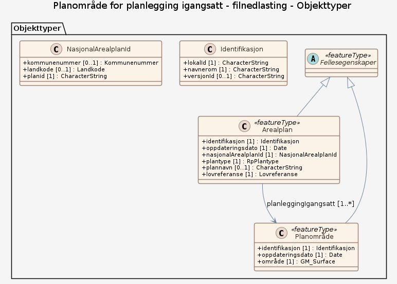

# Produktspesifikasjon: Planområde for planlegging igangsatt

## Generelt om spesifikasjonen

### Unik identifisering

779a554b-fc3e-48a6-b202-561b07e9d4c2

#### Fullstendig navn

Planområde for planlegging igangsatt

#### Versjon

2025-10-17

### Referansedato

2025-10-17

### Ansvarlig organisasjon

Direktoratet for byggkvalitet

### Språk

nor

### Hovedtema

planområde, planomriss, Arealplan, Plan

### Temakategori

Plan og eiendom

### Sammendrag

Datasettet viser område(r) hvor det er varslet at planlegging skal igangsettes etter plan- og bygningsloven (pbl). Formålet er å kunne identifisere og vise hvor planarbeid er startet, slik at naboer, berørte parter, høringsmyndigheter og kommunen får informasjon om planinitiativet.

### Formål

Formålet er å kunne identifisere og vise hvor planarbeid er startet, slik at naboer, berørte parter, høringsmyndigheter og kommunen får informasjon om planinitiativet og kan medvirke i prosessen.

### Bruksområde

Datasettet brukes som grunnlag ved oversendelse av planinitiativ til kommunen og høringsparter, i varsel om oppstart av planarbeid, som underlag i saksbehandling, uttalelser fra høringsmyndigheter og registrering i  kommunale planregister, samt for visning i kartløsninger.

### Romlig representasjonstype

Rasterbilde/digital terrengmodell

### Romlig oppløsning

**Avstand**:

- **Måleenhet**: meter
- **Verdi**: 0.01

### Utstrekning

**Geografisk utstrekning**:

- **Vest**: 2.0
- **Øst**: 33.0
- **Sør**: 57.0
- **Nord**: 72.0

**Tidsmessig utstrekning**:

- **Tidsperiode**:
  - **Fra**: 2025-10-17
  - **Til**: 2025-10-17

### Begrensninger

**Juridiske begrensninger**:

- **Tilgangsbegrensninger**: Åpne data
- **Bruksbegrensninger**: Lisens
- **Lisens**: Norsk lisens for offentlige data (NLOD) 2.0
- **Lisenslenke**: <https://data.norge.no/nlod/no/2.0>

**Sikkerhetsbegrensninger**:

- **Klassifisering**: Ugradert

## Spesifikasjonsomfang

- **Omfang**:

  - **Identifikasjon**: hele datasettet
  - **Nivå**: dataset
  - **Utstrekning**: - **Beskrivelse**: National
  - **Nivåbeskrivelse**:
    #### filnedlasting
    Insert beskrivelse her

## Innhold og struktur

**Beskrivelse**: Datasettet brukes som grunnlag ved oversendelse av planinitiativ til kommunen og høringsparter, i varsel om oppstart av planarbeid, som underlag i saksbehandling, uttalelser fra høringsmyndigheter og registrering i  kommunale planregister, samt for visning i kartløsninger.

### Datamodell - filnedlasting

[Objektkatalog - filnedlasting](filnedlasting/objektkatalog.html)

## Kvalitet

**Nivå**: dataset

## Datafangst

**Datainnsamling og prosessering**:

- **Prosesstrinn**: - **Beskrivelse**: datafangst skjer gjennom tjenesten varsel om planoppstart på fellestjenester plan som fylles ut av forslagsstiller eller plankonsulent

## Datavedlikehold

**Vedlikeholdsfrekvens**: Kontinuerlig

**Status**: Planlagt

## Leveranse

- **Leveranse**:

  - **Leveransemedium**:
    - **unitsOfDelivery**: landsfiler
    - **Medienavn**: OGC API-Features
    - **Leveransetjeneste**:
      - **Tjenesteendepunkt**: <https://plandata.ft.dibk.no/services/rest/planleggingigangsatt>
      - **Tjenesteegenskap**:
        - **type**: OGC API-Features
        - **Verdi**: OGC:API-Features
  - **Leveranseformat**: - **Formatnavn**: GeoJSON

- **Leveranse**:

  - **Leveransemedium**:
    - **unitsOfDelivery**: landsfiler
    - **Medienavn**: WMS-tjeneste
    - **Leveransetjeneste**:
      - **Tjenesteendepunkt**: <https://plandata.ft.dibk.no/services/wms/planleggingigangsatt/?service=WMS&request=GetCapabilities>
      - **Tjenesteegenskap**:
        - **type**: WMS-tjeneste
        - **Verdi**: OGC:WMS
  - **Leveranseformat**:
    - **Formatnavn**: PNG

    - **Formatnavn**: BMP

    - **Formatnavn**: GeoTIFF

    - **Formatnavn**: JPEG

    - **Formatnavn**: TIFF

- **Leveranse**:

  - **Leveransemedium**:
    - **Medienavn**: Planområde for planlegging igangsatt
    - **Leveransetjeneste**:
      - **Tjenesteendepunkt**: <https://plandata.ft.dibk.no/services/wms/planleggingigangsatt/?service=WMS&request=GetCapabilities>
      - **Tjenesteegenskap**:
        - **type**: Planområde for planlegging igangsatt
        - **Verdi**: WMS-tjeneste
  - **Leveranseformat**: - **Formatnavn**: PNG
  - **Leveranseomfang**: Tjeneste

## Metadata

**Metadatastandard**: ISO19115

**Metadatastandardversjon**: 2003

**Metadatadato**: 2026-01-28

**språk**: nor

**Kontakt**:

- **Organisasjon**: Direktoratet for byggkvalitet
- **Kontaktperson**: Olaug Hana Nesheim
- **Logo**: <https://register.geonorge.no/data/organizations/974760223_DIBK_liten.jpg>
- **Epost**: ftb@dibk.no
- **rolle**: pointOfContact

**Metadataidentifikator**:

- **Utsteder**: Geonorge
- **kode**: 779a554b-fc3e-48a6-b202-561b07e9d4c2
- **koderom**: <https://kartkatalog.geonorge.no/metadata/>
- **Metadatalenke**: <https://kartkatalog.geonorge.no/metadata/779a554b-fc3e-48a6-b202-561b07e9d4c2>

**Lenker**:

- **lenke**: <https://www.geonorge.no/geonetwork/srv/nor/csw?service=CSW&request=GetRecordById&version=2.0.2&outputSchema=http://www.isotc211.org/2005/gmd&elementSetName=full&id=779a554b-fc3e-48a6-b202-561b07e9d4c2>
  **relasjon**: describedby
  **type**: application/xml
  **tittel**: Metadata (ISO 19139)

- **lenke**: <https://plandata.ft.dibk.no/services/rest/planleggingigangsatt>
  **relasjon**: enclosure
  **type**: text/html
  **tittel**: Nedlasting

- **lenke**: <https://plandata.ft.dibk.no/services/wms/planleggingigangsatt/?service=WMS&request=GetCapabilities>
  **relasjon**: alternate
  **type**: text/html
  **tittel**: Kartvisning

- **lenke**: #!?zoom=3&lon=306722&lat=7197864&wms=<https://plandata.ft.dibk.no/services/wms/planleggingigangsatt/>
  **relasjon**: service
  **type**: text/html
  **tittel**: Tjeneste
